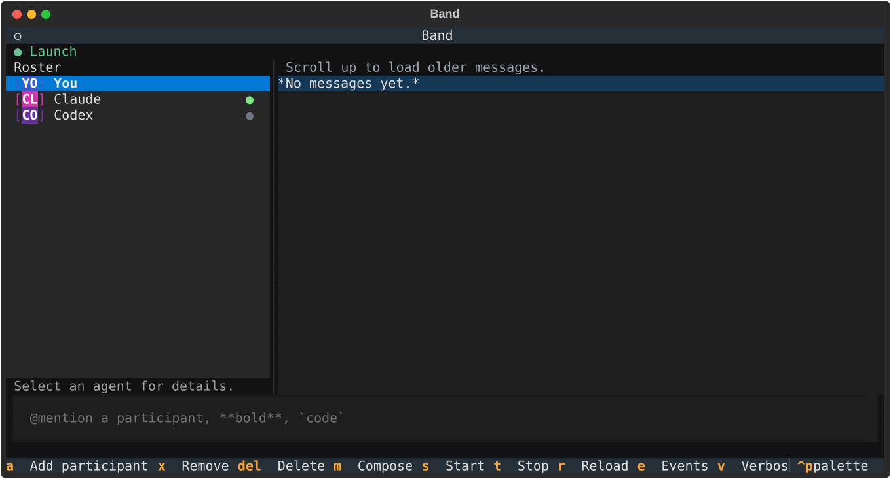
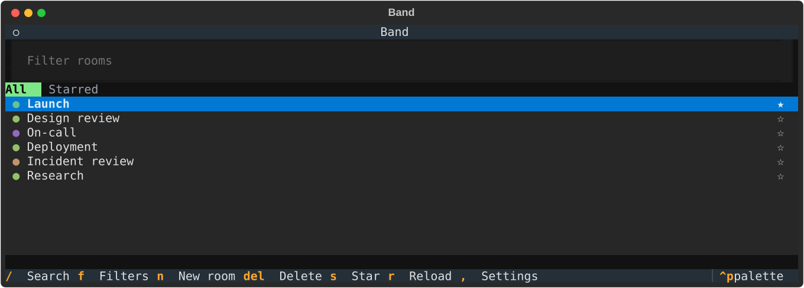
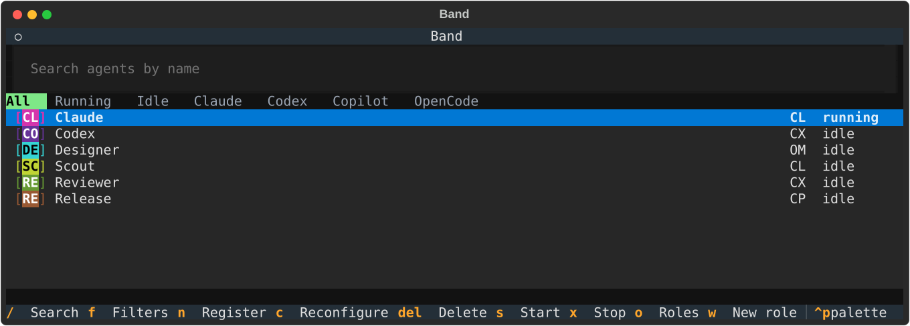
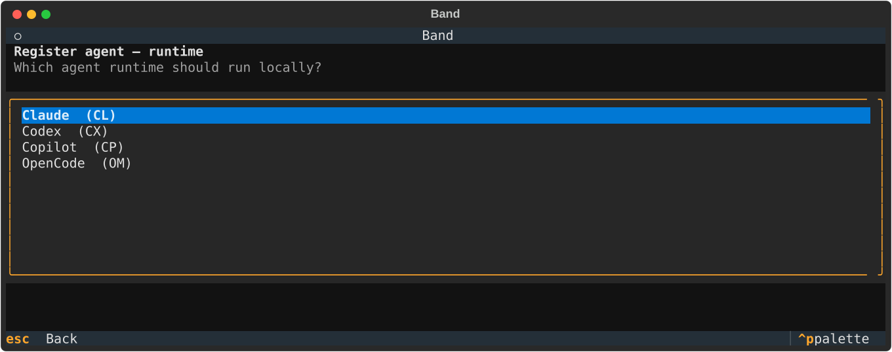
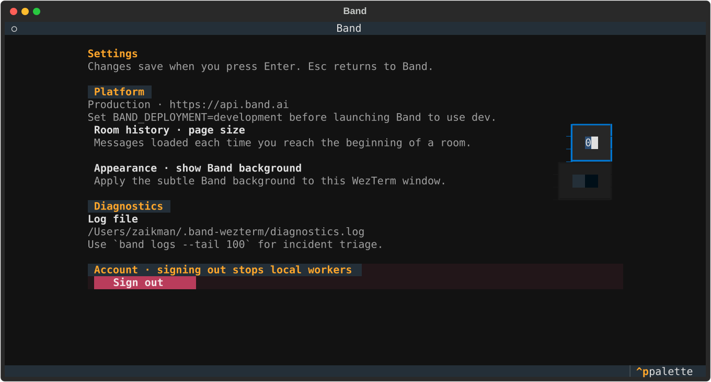

<div align="center">


# Band for WezTerm

[](https://github.com/band-ai/band-wezterm/actions/workflows/ci.yml)
[](https://www.python.org/downloads/)
[](LICENSE)

**Persistent Band rooms and managed agents, in the WezTerm layout you already use.**

Every Band view is disposable. Managed agents are detached workers: closing a tab, split, or window never stops them.

[Install](#install) · [Commands](#commands) · [Lifecycle](#agent-lifecycle) · [Development](#development)

</div>

<p align="center">
  
</p>

## The model

Band follows WezTerm rather than replacing it. Create tabs, panes, and windows with your normal workflow; run a Band command in the pane where you want that surface to live.

| You own | Band owns |
| --- | --- |
| Windows, tabs, splits, focus, and key bindings | Rooms, messages, participant roster, roles, and managed-agent workers |
| Where and how many views are open | An agent's durable profile and detached runtime |

There is no global Control window to find or reuse. `band room` and `band agent` each open an independent surface. You can have any number of either, including two views of the same room. Closing them only closes the view.

## Install

Install [Python 3.12+](https://www.python.org/downloads/), [uv](https://github.com/astral-sh/uv), [WezTerm](https://wezterm.org/), and [Git](https://git-scm.com/). No GitHub account or GitHub CLI is required.

### Stable release

```bash
curl -fsSL https://github.com/band-ai/band-wezterm/releases/latest/download/install.sh | bash -s -- --release
```

```powershell
$installer = Join-Path ([System.IO.Path]::GetTempPath()) "band-wezterm-install.ps1"
Invoke-WebRequest https://github.com/band-ai/band-wezterm/releases/latest/download/install.ps1 -OutFile $installer
& $installer -Channel release
Remove-Item $installer
```

Run an installer with `-h` / `--help` (PowerShell: `-h`) to see its accepted options.

### From source

```bash
git clone --branch main --single-branch https://github.com/band-ai/band-wezterm.git
cd band-wezterm
./install.sh
```

```bat
install.bat
```

The installer configures the WezTerm plugin. Reload WezTerm configuration (`Ctrl+Shift+R`) and run `band` for command help.

## Commands

Use your normal WezTerm tabs, panes, windows, and shortcuts. Run Band in the
pane where you want a disposable view; reopening a view never creates or stops
an agent.

```console
band                         # help and the primary workflows
band room                    # interactive room browser
band room open planning      # open an exact title or unique ID prefix
band room list --name plan --limit 20 --offset 0
band room create planning
band room delete planning

band agent                   # interactive agent browser
band agent list --name writer --harness cx --state running
band agent create
band agent configure 693c9f27
band agent start 693c9f27
band agent stop 693c9f27
band agent stop --all
band agent status 693c9f27
band agent delete 693c9f27

band status                  # paged rooms, then agents
band status --room           # rooms only
band status --agent          # agents only
band logs --tail 100
band completion              # install zsh, bash, or fish completion
```

Read the complete generated [CLI reference](docs/cli.md) for every argument
and option. `band status --room` and `band status --agent` are mutually
exclusive; so are an agent reference and `--all` in `band agent stop`.
The surface uses local, context-specific keys and never reserves global Ctrl or
function-key bindings. WezTerm shortcuts remain yours.

### Rooms

`band room` opens the complete room experience: create and filter rooms, open
one, add participants, chat, and start or stop a selected managed participant.
The timeline follows the newest event. Scroll upward at its earliest loaded
event to fetch the next page of older history; `End` returns to live activity.
Each event shows seconds, a semantic tag, colored authors, and color-matched
mentions. Select an event then press `d` for its full formatted detail.
In the composer, type `@` plus a visible participant name; Tab or Right Arrow
completes the mention.

Run the command again anywhere to open another independent Room surface.

Terminal lists are paged to 20 rows by default. Use `band room --name room`
(or `band room list --name room`) for room titles beginning with `room`;
`--limit` and `--offset` navigate large lists. Agent lists use the same options,
plus local runtime filters: `band agent --name my-ag --harness cp --state running`.
Harnesses are `cl` (Claude), `cx` (Codex), `cp` (Copilot), and `om` (OpenCode);
states are `starting`, `running`, `stopping`, `stopped`, and `error`.

<p align="center">
  
</p>

### Agents and roles

`band agent` opens the dedicated Agents experience. Press `n` to register an agent through runtime, role, name, description, and model/reasoning choices. Use `c` to reconfigure, `s`/`x` to start/stop the selected agent, and `Delete` to remove it.

`band agent create` opens that registration wizard immediately. `band agent configure NAME_OR_ID` resolves one exact agent first, then opens its reconfiguration wizard; it never silently falls back to an unselected list. The list remains the right surface for browsing, runtime status, role management, and ad-hoc lifecycle actions.

`band agent list` is a compact overview. Add `--verbose` (or `-v`) for full
agent IDs, selected harnesses, and local worker PIDs. References accept an
exact name or a unique ID prefix; ambiguous prefixes show matches instead of
guessing.

Use a unique ID prefix anywhere an agent or room reference is accepted: `band agent 693c9f27` opens Agents with that agent selected, and `band agent start 693c9f27` starts it. Run `band completion` once to install zsh, bash, or fish completion for Band commands and options.

Roles are Markdown personas in `~/.band/roles`. Default roles are seeded on first use. A registered agent saves a role snapshot and tuning as its durable local profile; reconfigure it to adopt later role edits.

<p align="center">
  
</p>

<p align="center">
  
</p>

## Agent lifecycle

An agent is not a WezTerm pane. Starting an agent asks the local, authenticated supervisor to launch one detached Band SDK worker. That worker subscribes to the agent's rooms and continues after every Band view is closed.

```text
band agent start AGENT_ID
          │
          ▼
local supervisor ── launches ──► detached worker ──► Band rooms
          ▲                              │
          └──── any room/agent view ─────┘
```

Workers stop only when you explicitly Stop them, delete their agent, sign out, the worker encounters a fatal error, or the machine/process shuts down. A later `band room`, `band agent`, `band agent list`, or `band status` reconnects to the same local supervisor and reports the still-running worker.

Each profile selects Claude, Codex, Copilot, or OpenCode. Host-side authentication for the selected runtime must already work. Install all adapters with `uv sync --extra agents`, or install individual extras as needed.

## Configuration and security

Band targets production by default. Set `BAND_DEPLOYMENT=development` before launching Band to use the development REST and WebSocket deployment; development credentials, local agent profiles, room state, diagnostics, and supervisor state remain isolated from production. `BAND_OAUTH_ISSUER`, `BAND_BASE_URL` (or `BAND_REST_URL`), and `BAND_WS_URL` support an explicit custom deployment; `BAND_OAUTH_CLIENT_ID` selects another public OAuth client.

Tokens and managed-agent API keys are stored only in the OS keyring. Diagnostic
logs at `~/.band-wezterm/diagnostics.log` rotate locally and record room/agent
operation requests, outcomes, resource IDs, worker state, and safe error
types—never tokens, request headers, message bodies, room titles, or working
directories. OSC user variables carry only allowlisted display metadata.

Settings also control chat-history page size, event visibility, and an optional
very-low-opacity Band background. The background is off by default, applies only
to the active Band WezTerm window, and restores that window's prior runtime
background when disabled.



## Development

```bash
just sync            # core + development tools
just sync-agents     # all agent runtime extras
just setup           # update local WezTerm plugin configuration
just test            # unit tests
just test-wezterm    # live WezTerm CLI checks
just test-live       # live platform PTY checks; requires BAND_API_KEY_USER
just screenshots     # refresh README SVGs without WezTerm or platform access
```

`plugin/init.lua` is the source of truth for the WezTerm plugin. Re-run `band setup` after editing it, reload WezTerm configuration, and use `wezterm.plugin.update_all()` from the Debug Overlay when needed.

See [the architecture map](docs/architecture.md) for where to add commands, screens, and harness support.

## License

[MIT](LICENSE) © band.ai
